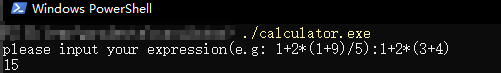
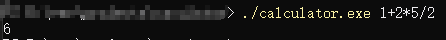

# calculator

## 完成度
使用各种语言实现的表达式解析器，可根据输入的表达式（算式），计算出对应的值

| op\language | c++  | java   | python |   js  |  
| :---------- | :--: | :----: | :----: | :---: | 
| +           | ✓    | ✘     | ✓     | ✓     |  
| -           | ✓    | ✘     | ✓     | ✓     |  
| *           | ✓    | ✘     | ✓     | ✓     |  
| /           | ✓    | ✘     | ✓     | ✓     |  
| %           | ✓    | ✘     | ✓     | ✓     |  
| ()          | ✓    | ✘     | ✓     | ✓     |  
| ^           | ✘    | ✘     | ✘     | ✘     |  
| !           | ✘    | ✘     | ✘     | ✘     |  

* python使用eval实现
* js使用eval实现
* c++的实现方式为，先构建出表达式的语法树，然后再进行计算

## 使用方式

#### C++
首先[下载calculator.exe](https://github.com/spawpaw/calculator/releases), 
###### 直接打开

###### 在参数中传入算式

